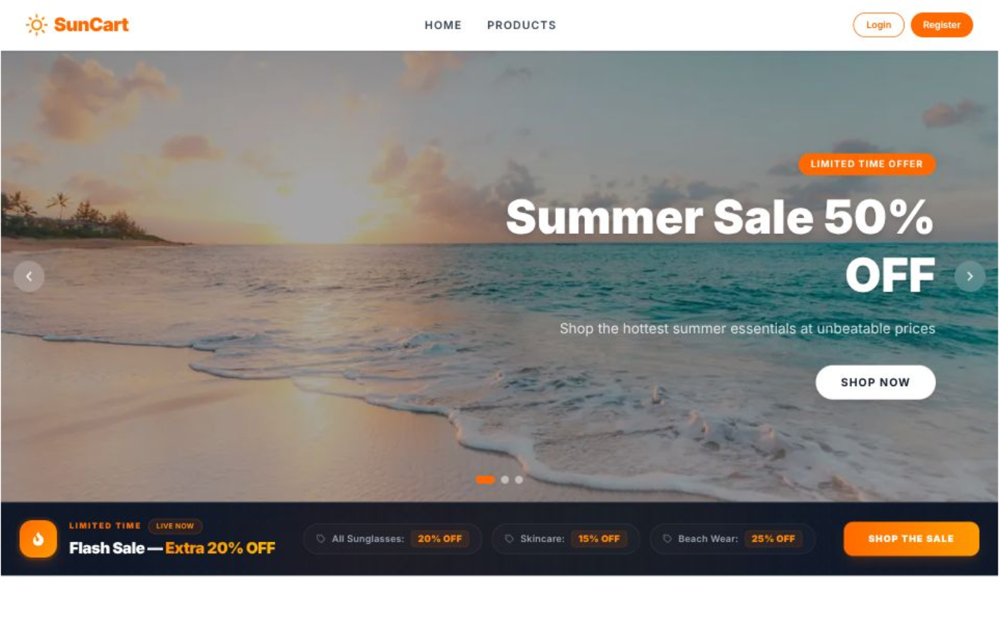

# SunCart - Modern E-Commerce Platform 🛍️

A high-performance, full-stack e-commerce platform built with Next.js 14, featuring real-time API integration, advanced filtering, and a modern UI/UX design.

[](https://ph-a-08-sun-cart.vercel.app)
[](https://nextjs.org/)
[](https://reactjs.org/)
[](https://tailwindcss.com/)
[](https://daisyui.com/)

## 🚀 Live Demo

**[View Live Project →](https://ph-a-08-sun-cart.vercel.app)**

## 📸 Preview

*A sleek, modern e-commerce experience with dynamic product catalog, advanced filtering, and seamless authentication.*

## ✨ Key Features

### Core Functionality
- **RESTful API Integration** - Dynamic product fetching from external API endpoints
- **Advanced Filtering System** - Multi-criteria filtering with category-based navigation
- **Smart Sorting** - Price, rating, and popularity-based product sorting
- **Dual View Modes** - Toggle between grid and list product layouts
- **Real-time Product Search** - Instant results with optimized queries
- **Dynamic Routing** - Server-side rendered product detail pages
- **Session-based Authentication** - Secure user authentication with Better-Auth

### UI/UX Excellence
- **Responsive Design** - Optimized for mobile, tablet, and desktop viewports
- **Continuous Marquee** - Smooth, infinite scrolling brand/promotion display
- **Hero Slider** - Engaging homepage carousel with promotional content
- **Glassmorphism Effects** - Modern UI with backdrop blur and transparency
- **Micro-interactions** - Hover states, transitions, and loading animations
- **Image Optimization** - Next.js Image component for lazy loading and WebP conversion

### Technical Highlights
- **Server-Side Rendering** - SEO-optimized pages with fast initial load
- **Client-Side Hydration** - Smooth navigation without full page reloads
- **Optimistic UI Updates** - Instant feedback on user interactions
- **Error Boundaries** - Graceful error handling and fallback UI
- **Type-safe Data Flow** - Structured API responses and prop validation

## 🛠️ Tech Stack

```
Frontend Framework   →  Next.js 14 (App Router)
UI Library           →  React 18
Styling              →  Tailwind CSS, DaisyUI
Authentication       →  Better-Auth
Database Engine      →  MongoDB Atlas (Cloud Tier Distributed Cluster)
Database Driver      →  MongoDB Node Client Driver Adapter
Icons                →  React Icons
Image Optimization   →  Next.js Image
API Integration      →  Fetch API
State Management     →  React Hooks (useState, useEffect, useMemo)
Deployment           →  Vercel
```

## 📦 Installation & Setup

```bash
# Clone repository
git clone https://github.com/salmanibneyrahman/PH-A-08-SunCart.git

# Install dependencies
npm install

# Configure environment variables
cp .env.example .env.local

# Run development server
npm run dev
```

**Environment Variables:**
```env
NEXT_PUBLIC_API_URL=https://suncart-website.onrender.com
BETTER_AUTH_SECRET=your-secret-key
BETTER_AUTH_URL=http://localhost:3000
```

## 🎯 Performance Optimizations

- ✅ **Code Splitting** - Dynamic imports for reduced bundle size
- ✅ **Image Lazy Loading** - Progressive image loading with blur placeholders
- ✅ **Memoization** - React.useMemo for expensive computations
- ✅ **Debouncing** - Optimized search and filter operations
- ✅ **Server-Side Rendering** - Faster initial page loads and better SEO
- ✅ **Route Prefetching** - Next.js automatic link prefetching

## 🔐 Security Features

- Protected routes with middleware authentication
- Session-based user management
- HTTPS enforcement on production
- Environment variable encryption
- XSS protection with React's built-in sanitization

## 📱 Responsive Breakpoints

```css
Mobile:     < 640px
Tablet:     640px - 1024px
Desktop:    > 1024px
```

## 🚀 Deployment

**Automated Deployment Pipeline:**
```bash
git push origin main  →  Vercel Auto-Deploy  →  Live in 30s
```

**Production Build:**
```bash
npm run build
npm start
```

## 💡 Future Enhancements

- [ ] Shopping cart with persistent state
- [ ] User wishlist functionality
- [ ] Product reviews and ratings
- [ ] Advanced search with Algolia
- [ ] Payment gateway integration (Stripe)
- [ ] Order management dashboard
- [ ] Email notifications
- [ ] Analytics integration

---

**⭐ Star this repository if you found it helpful!**

Built with precision and passion for modern web development.